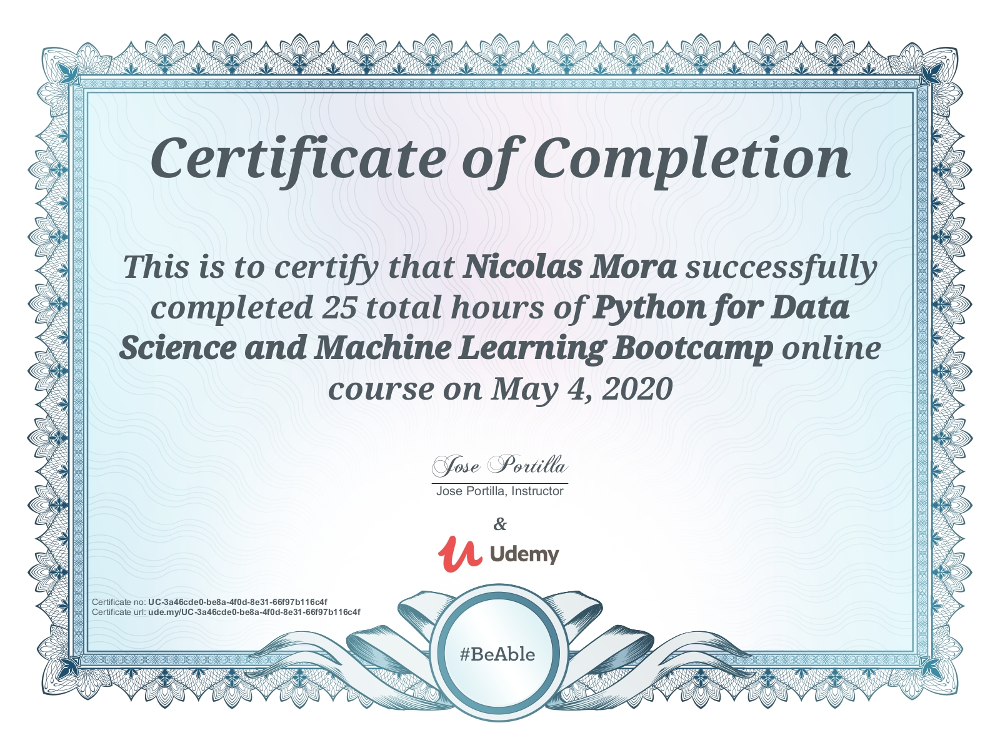
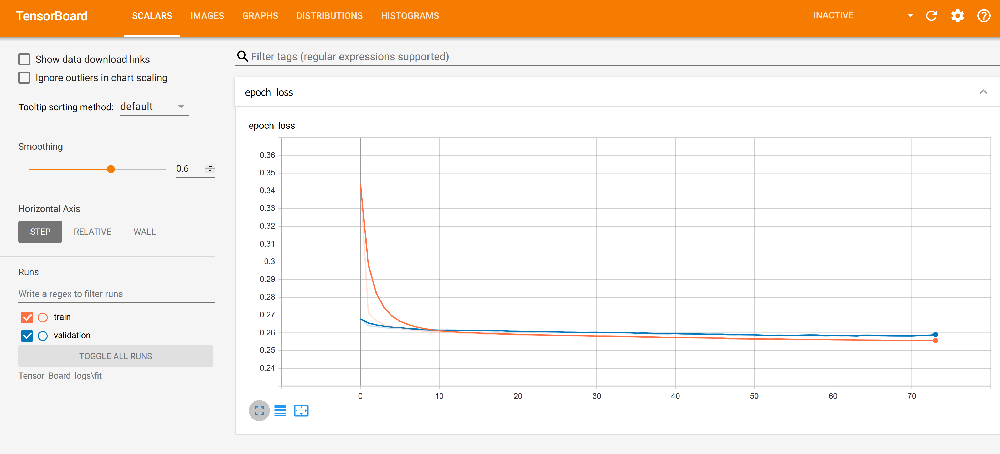
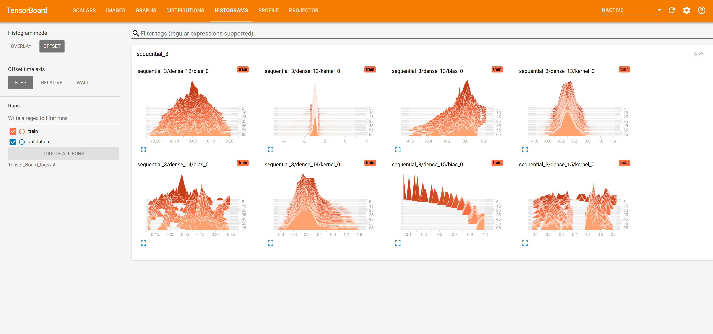

  

# Python for Data Science and Machine Learning Bootcamp exercises and projects

## Table of contents
* [Introduction](#introduction)
* [Technologies](#technologies)
* [Certificate of Completion](#certificate-of-completion)
* [Tensorboard Visualizations](#tensorboard-visualizations)

## Introduction
This is a repository of my projects and exercise solutions for the Udemy course, [Python for Data Science and Machine Learning Bootcamp](https://www.udemy.com/course/python-for-data-science-and-machine-learning-bootcamp/).

The repo *.ipynb files (Jupyter Notebook) contain headers describing the code, followed by the code itself, and plots created. Since the Python code is written in Jupyter Notebooks, the plots created by the code are visible on Github itself without needing to run the code. This can be done by clicking on the *.ipynb file of an exercise or project on GitHub.

## Certificate of Completion

## Technologies
- Python 3.7.6
- NumPy 1.17.2
- Pandas 1.0.3
- Seaborn 0.9.0
- Matplotlib 3.1.1
- Plotly 4.6.0
- Scikit-Learn 0.21.3
- nltk 3.5
- Tensorflow 2.1.0
- Tensorboard 2.1.1
- Keras 2.3.1

## Tensorboard Visualizations
The tensorboard visualizations for the "25-Neural-Nets-and-Deep-Learning" are only able to be shown by running tensorboard, so the following are some snapshots of Tensorboard when run for the [Keras project exercise model](./25-Neural-Nets-and-Deep-Learning/03-Keras-Project-Exercise.ipynb).

### Loss and Validation Loss
The following shows the loss and validation loss of the model over time.

As can be seen above, the loss and validation loss stabilized, then the model stopped training at close to 75 epochs.

### Weights and Biases of Layers
The following shows the histograms of the weights and biases of the layers.

As can be seen above, the weights and biases of the layers changed erratically at first, but stabilized over time.
